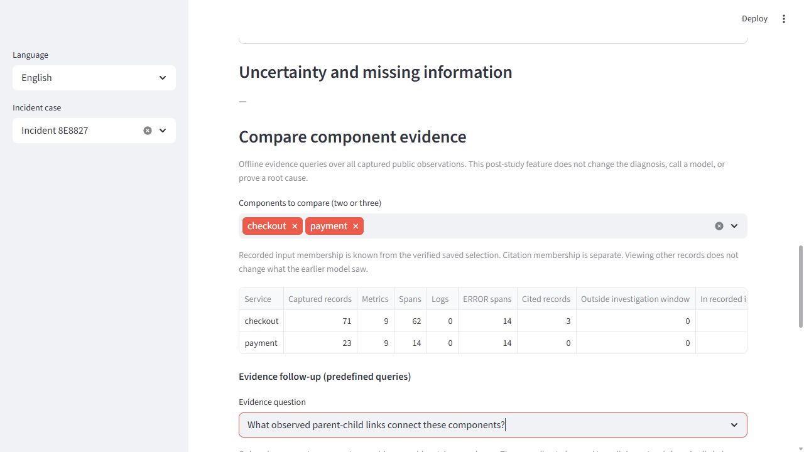

# Offline component comparison and evidence follow-up

Author: Dahe Chen. Post-study engineering extension, October 1, 2026.

This feature was added after the October 1 frozen study and its 30-call budget.
It was not part of those model experiments. It makes captured records easier to
inspect; no improvement in diagnosis accuracy, user benefit, or root-cause proof
has been measured.

## Application behavior

After loading an analysis, choose two or three components under **Compare
component evidence**. The table counts captured metric, span, and log records,
ERROR spans, citations, and records outside the incident time window. Counts
describe recorded data rather than fault probabilities or independent signals.
All public observations are eligible for inspection, including uncited records.

Three predefined follow-ups answer deterministic evidence queries:

- **Which captured records belong to this component?** Lists that component's
  records in timestamp/ID order, with original raw fields and source references.
- **What observed parent-child links connect these components?** Matches unique
  `parent_span_id` and `span_id` values within the same `trace_id`. Missing,
  ambiguous, and self-referencing parents remain separate; known parents outside
  the selected components are also shown separately. These direct captured
  links do not infer a complete call chain or prove causal propagation.
- **Which selected-component records were outside the recorded model input?**
  Uses the validated recording's unchanged public-case hash and saved selected
  IDs. Being selected and being cited are different properties. The live Gemini
  result currently preserves a count rather than selected IDs, so membership is
  explicitly unknown. It is inapplicable to the deterministic local baseline.

The questions are predefined queries, not free-form conversational AI. Selecting
components does not alter the diagnosis or its original model input. Inspecting
additional records does not imply that the earlier model saw them. Source URLs
can expire; extracted fields remain available locally.

## Data and implementation boundary

`autotriager_shop/investigation.py` accepts already loaded public observations
and the current analysis. It reads no files, evaluator labels, credentials, or
runtime flags, and makes no network calls. The app loads the existing recording
through its original integrity/validation path before comparison. Frozen Gemini
functions, schema, scorer, exported examples, and the historical PDF remain
unchanged. English and Chinese interface labels are supported.

## Concrete check

The unchanged official confirmation `003-b` recording suggests `checkout`.
Component comparison still exposes the payment service's 14 captured ERROR
spans, uncited selected payment spans `span-00007` and `span-00008`, and actual
checkout-to-payment parent-child references. The old suggestion remains
checkout. This demonstrates inspectability of a disagreement, not that payment
is proven to be the optimal next action.

Tests check this actual counterexample, recorded-input/citation separation,
unknown live input membership, trace identity and ambiguity, chronology, case
binding, private-field rejection, and absence of file/API access in comparison.
UI regression checks cover translated controls and incident changes. A human
task study remains necessary to measure whether this feature helps users.

## Browser verification

On October 1, the actual Streamlit replay of incident `8E8827` preserved the
checkout suggestion. Selecting checkout and payment displayed 14 ERROR spans
for each, three cited checkout records and zero cited payment records. The
recorded model input contained eight records from each component. The observed
links query showed the actual payment child `span-00008`; the input-coverage
query separately exposed unselected records such as checkout `span-00086`.
No Gemini analysis button was invoked and the human judgment remained empty.
This checks UI behavior, not correct first inspection or user benefit.

