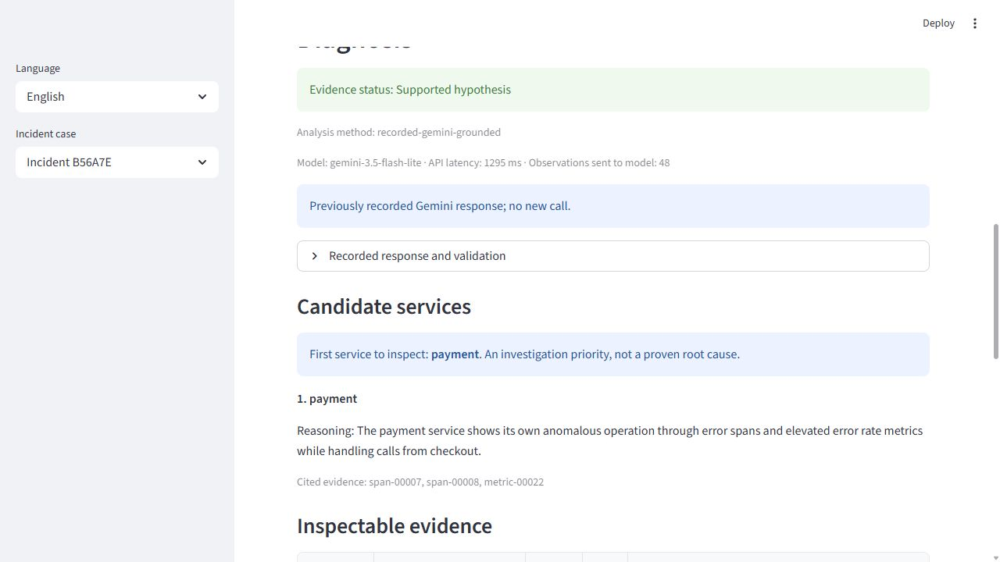
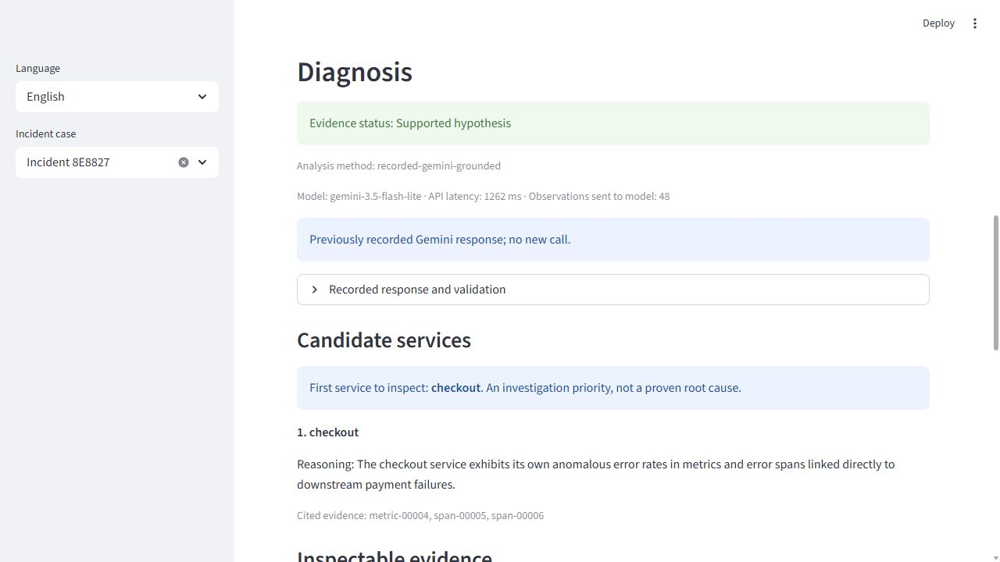

# AutoTriager Shop: Evidence-Grounded Investigation and a Bounded Evaluation

**Dahe Chen — CS 5588 Data Science Capstone, Challenge 2**
**October 1, 2026 — Completed bounded development and confirmation round**

## 1. Abstract

A junior on-call developer new to a shopping system may confuse payment failure with checkout symptoms. AutoTriager provides a read-only investigation feature: select an incident, inspect cited telemetry, and record judgment. Python selects structured evidence; optional Gemini reasoning proposes a service to inspect or defers. Thirteen capture attempts yielded ten accepted windows; nine were eligible for modeling within one development and two confirmation groups. Thirty API calls yielded twenty-eight responses and two HTTP 503 failures. Balanced selection alone established no diagnostic gain. An adaptive investigation-priority change matched the payment label in development, but frozen confirmation selected checkout once and payment once. Both methods deferred on all four confirmation controls. The direct reference matched payment twice, although it asks a different question. Valid citations and control abstention did not ensure faithful explanations. This single-mechanism study establishes an inspectable pipeline, not optimal inspection, causal correctness, generalization, or user benefit.

## 2. Introduction and research question

Payment failure can produce checkout dependency errors and storefront failure. A junior developer understands application basics but lacks this system's relationships and history. The decision is which service to inspect first, supported by original records.

The semester project concerns incident investigation. Challenge 2 selects P1: load one system's incident, analyze it, inspect sources, and record review. Input is a bounded telemetry interval; output is a candidate or insufficient-evidence decision, references, missing information, and judgment. Historical management and richer interactions follow this first complete path.

The bounded question is: **given payment-failure telemetry with propagated symptoms, can a fixed-budget pipeline propose a checkable first service to inspect while deferring unsupported attributions?** Development first tested initiating-service attribution, then explicitly amended the task to investigation priority. Intervention-label agreement is descriptive: it does not identify the optimal inspection action. The contribution is the inspectable feature and controlled study, with candidate failures and unresolved evidence reported.

## 3. Related work

[OpenRCA, ICLR 2025](https://proceedings.iclr.cc/paper_files/paper/2025/file/d29b8d53678015079e1d245c023e49d2-Paper-Conference.pdf), Section 2.3, formulates recovery of requested fault attributes from telemetry; RCA-Agent explores records using generated Python. [EviRCA, arXiv:2609.19825v1](https://arxiv.org/html/2609.19825v1), Sections III-B/C, separates deterministic extraction from bounded read-only reasoning. Its Section V-B discusses assumptions including known fault counts and candidate sets. Thus extraction before reasoning, evidence cards, and read-only analysis are existing ideas. [MicroRCA-Agent, arXiv:2509.15635v1](https://arxiv.org/html/2509.15635v1), Sections 3.5 and 4.1, provides structured reasoning and reports fabricated call-chain evidence, motivating a separate support audit.

These are closest-work references, not locally replicated baselines. Published benchmark scores are not comparable to this live Shop protocol. The proposed study emphasizes selective investigation priority and incomplete observations; it has not established a literature gap or superiority over these methods.

## 4. Problem and three-stage design

### 4.1 Human decisions and honest provenance

Earlier AI-assisted discussions established one system, a small case set, read-only analysis, evidence inspection, and accept/reject/uncertain review. They prioritized existing analysis over agent orchestration. “Human Design” identifies the user's decisions before accepting implementation, not a time-stamped, entirely AI-free original document.

The user's P1 combines incident loading and existing-method analysis, followed by checkable result presentation. This complete path comes first because later features depend on a usable investigation. History, a richer interface, and evaluated analysis improvements are P2; additional systems are P3. The current cycle implements one local path rather than the entire semester roadmap.

Benchmark replay did not establish the chosen shopping scenario. The user retained the investigation boundary but switched to a runnable shopping workflow. Figure 1 reconstructs those recorded decisions.

```text
Checkout symptom → select incident → compare service hypotheses
                 → open original records → accept / reject / uncertain
                 → human decides the next operational investigation
```

**Figure 1. Reconstructed human-selected workflow from recorded choices.** It is not a recovered original drawing.

### 4.2 AI proposal and critical evaluation

Codex examined the handout, design records, repository, and simulator. The instruction, paraphrased, was: investigate a running shopping incident, isolate labels, cite evidence or abstain, and use a capable direct comparator. This summarizes the actual conversation.

The assistant proposed compact records, stable IDs, timestamps, trace relationships, ranking, optional model interpretation, and a bilingual interface. Separating computation from explanation helped implementation; benchmark framing, weak comparison, runtime feasibility, and evidence sufficiency still required correction.

The proposed evaluation compared service predictions with benchmark answers and checked references. That was useful for an initial offline pipeline, but it did not establish a user need in the shopping application. Reviewed co-design replaced the primary input with captured Shop telemetry, retained a direct model reference and normal/recovery controls, and separated label agreement from explanation support. RAG and additional agents remained alternatives rather than requirements: no measured knowledge gap justified their implementation in this cycle.

```text
Incident data → adapter → compact evidence → LLM / possible tools
              → diagnosis dashboard
```

**Figure 2. Reconstructed AI proposal.** This summarizes the earlier direction; it does not imply every proposed component was implemented.

### 4.3 Reviewed co-design

Human judgment retained the review boundary, accepted structured provenance, rejected benchmark replay as product validation, simplified orchestration, and required private labels and a strong comparator. Development responses demanded deeper-cause evidence although the application intended to prioritize inspection. Co-design explicitly clarified that task while preserving the same evidence. This observation does not establish that the earlier prompt was defective. These choices improve inspectability by design; their user benefit remains untested.

Four user-reported instructor concerns drove concrete changes; these are paraphrases of the recorded discussion, not recovered written quotations:

- **Who needs the output?** The design now names an on-call developer new to this shopping system and the first inspection decision. A user-task study remains absent.
- **What actual situation motivates it?** Official Astronomy Shop checkout captures replace benchmark replay as the primary application scenario. Runtime and intervention receipts document the new setting.
- **Why use a product if an engineer can prompt directly?** The study retains a capable direct reference and reports the negative comparison. The interface adds inspectable source records rather than claiming that a dashboard proves superiority.
- **How can the result be checked?** Preserved IDs, numerical fields and parent references support source inspection; a separate claim audit exposes unsupported explanation sentences.

| Aspect | Human Design | AI Design | Reviewed co-design |
|---|---|---|---|
| Problem understanding | First investigation priority | Broad incident diagnosis | Checkout symptom propagation |
| Data understanding | Public incident records | Benchmark adapter | Captured Shop; private interventions |
| Architecture | One complete P1 | Generic analysis pipeline | Bounded evidence-to-review path |
| Multimodal design | Metrics, traces, available logs | Compact representations | Preserve values, times, trace links |
| Retrieval / RAG | Relevant records | Evidence selection | Balanced rule/metadata policy; no embeddings |
| Models / tools | Reuse existing capability | Python plus LLM | Tools compute; Gemini interprets |
| Grounding | Human source inspection | Evidence IDs | Resolve IDs; separately audit support |
| Implementation | Local review interface | Code/schema assistance | Streamlit plus answer-isolated contract |
| Debugging | Verify assumptions | Suggested repairs | Record runtime/parser fixes separately |
| Evaluation | Actual cases and failures | Initial prompt comparison | Same inputs; raw/validated outputs; frozen confirmation |
| Final quality | Understandable decision aid | Runnable proposal | Inspectable prototype; benefit unmeasured |

**Table 1. Eleven-aspect course comparison.** Design improvements are arguments about traceability and scope, not measured performance gains.

## 5. Data, method, and application

The official source is [OpenTelemetry Demo 3.1.0](https://github.com/open-telemetry/opentelemetry-demo/tree/dedc0178918e260823323b8d95005a8cb924b007), commit `dedc0178918e260823323b8d95005a8cb924b007`, licensed Apache-2.0. Prometheus/Jaeger captures produced three accepted development windows containing 2,793 observations: 393 metrics and 2,400 spans, with no captured logs. The metric `span_error_rate` measures error-span events in calls/s, not a percentage, and is span-derived rather than independent causal corroboration. Table 2 records each window.

The final modeled cohort contains nine dependent phase windows: three development and six confirmation, totaling 8,379 observations (1,179 metrics and 7,200 spans). These are repeated conditions of one mechanism, not nine fault categories. The additional accepted 004 normal is preserved outside the complete-group model cohort.

Observations retain ID, service, UTC time, signal kind, numerical fields, trace/span relationships, and source URLs. Python validates fields, normalizes time, selects records, and ranks explicit anomalies. Public `incident.json` and `observations.json` supply inference. These preserve extracted telemetry fields, not complete original HTTP response archives. Source availability depends on the live system's retention. Private intervention manifests supply evaluation only; known answer fields are rejected from public inputs.

```text
Official Shop → Prometheus / Jaeger → preserved extracted telemetry
              → bounded incident + structured observations
              → deterministic ranking / selected evidence
              → optional Gemini → validation → Streamlit source inspection
              → human judgment
Private intervention manifest ─────────────────→ offline scorer only
```

**Figure 3. Implemented official capture-to-analysis architecture.** Private labels branch only to evaluation; they are excluded from model and UI inputs.

The retrieval unit is an observation, capped at 48 records. Priority sorts explicit `is_anomalous` records first, ERROR/5xx records second, and remaining records last, breaking ties by time and ID. The provisional selector round-robins metric, span, and log queues in that order, skipping empty queues and preserving within-kind priority. Official metrics have no `is_anomalous` field, so their order is time/ID rather than measured anomaly magnitude. No embeddings, trained retriever, fine-tuning, or runtime agent team is used. Gemini returns status, candidate, reason, IDs, and missing information. A transparent rule baseline provides another starting point; its heuristic scores are not probabilities.

The application resolves citations and records accept/reject/uncertain review with reasons. Grounded validation requires a candidate present in the selected records, no invalid cited ID, and candidate-local citations from at least two signal kinds; otherwise it defers. The direct validator resolves IDs and checks candidate membership but has no two-kind gate. These structural checks do not establish semantic support. Multiple signal kinds can describe the same request; reference integrity, factual support, and localization remain distinct endpoints.

The user selects a neutral incident alias, reviews provenance, runs the baseline or optional Gemini analysis, opens evidence, and records judgment. API errors display incomplete analysis, not absence of an incident. Language switching preserves case state. Figure 4 shows actual official fault evidence in the application.

After the frozen 30-call study, an offline engineering extension adds selection of two or three components and predefined evidence queries. It compares the full public observation pool, marks recorded-input membership separately from citation membership, and resolves only unique same-trace parent-child links. Missing or ambiguous parents remain explicit. Live Gemini results do not retain selected IDs, so their membership is unknown. These queries do not modify an old answer, call a model or establish causal propagation. Their diagnostic or user benefit was not evaluated in the frozen study.



**Figure 4. Actual recorded analysis of an accepted official fault case.** The interface displays the saved payment inspection priority, explanation, and cited IDs, explicitly identifying replay and distinguishing priority from proven root cause. The screenshot establishes interface behavior, not diagnostic correctness or user benefit.

## 6. Experimental setup

The live deployment completed 18 source image builds and seven third-party pulls, starting 25 containers. Saved image identities matched the prepared images. The source tree remained clean; mutable flags were isolated outside it. Ports bind to localhost: Shop proxy 8080, Prometheus 9090, and Jaeger through proxy 8080. The scheduler was disabled; fixed load settings use five Locust users and HTTP/browser weights 9:1.

The first normal attempt contained checkout/payment ERROR spans and failed the unchanged acceptance gate. Investigation found checkout and catalog Go services limited to 20 MiB, with heavy cgroup pressure. A derived configuration raised each to 128 MiB. At 17:52:23 UTC both were healthy, zero unhealthy containers were recorded, and the recorded full-pressure value was zero. This is a host resource repair, not proof that every earlier error had that cause or a diagnosis improvement.

The pilot uses `paymentFailure=100%` with normal/recovery controls, 180-second warmup and recording windows, 75-second settling, and flag checks every 30 seconds. Acceptance requires checkout-to-payment linkage, visible payment error during fault, and no checkout/payment errors on the specified linked control paths. “Clean” concerns these observed paths, not every service or unobserved request. Gating conditions diagnosis on visible evidence; capture yield must be separate.

One development triplet permits at most three candidate changes. Two later fresh triplets are reserved after freezing method and scorer. Phases, traces, and repeated conditions are dependent; one mechanism tests narrow repeatability, not fault coverage.

Amendment A1, recorded at 18:25 UTC before official calls, addressed modality starvation: all 48 prioritized fault records were spans, conflicting with two-kind validation. Six original-selector and six balanced-selector calls tested this engineering hypothesis. The policy changes composition and ordering together; their effects are not separated. Balanced selection alone established no diagnostic gain.

Amendment A2 at 18:42 UTC followed those responses and simulated review. It allocated the remaining six calls to changing only the grounded objective: choose a defensible inspection priority, without asserting deepest cause. Balanced records/order, model, direct prompt, and validators stayed fixed. The direct prompt was called again and is a descriptive reference, not a deterministic control or same-task superiority comparator. Both metrics-only and spans-only experiments were deferred and remain untested. These are adaptive development amendments, not untouched preregistration.

The recovery timeout prompted explicit `127.0.0.1` origins for replacement `shop-pilot-002-d`. A faster probe does not prove the timeout's cause. The rejected interval is retained; timing, traffic, and gates stayed fixed. Payment failure was restored off and verified before accepted recovery.

Within each condition, prompts share identical records/order: `gemini-3.5-flash-lite`, temperature zero, 2,048 output-token cap, 90-second timeout, seed 5588, alternating order, and no retries. Raw and application decisions are preserved; alternative validators reuse raw responses without calls. Common-validator results separate prompt behavior from postprocessing. Quota/authentication errors stop calls and remain missing analyses.

`selected_method.json` froze balanced selection plus investigation-priority framing at 18:48:30 UTC, including function/scorer hashes. This is a provisional engineering choice: the full direct-reference no-regression gate is unknown because recovery returned 503. Confirmation triplet 003 started at 18:48:36 and completed three accepted captures at 19:10:24, including verified restoration. Its six calls completed without API failure. Triplet 004 accepted its normal phase but failed during fault collection at 19:22:55 because the feature API timed out; recovery was not attempted. Fault-off restoration was verified. Amendment A3, recorded before replacement 005 started at 19:27:36, permits one entire fresh group with its own baseline and unchanged methods. The remaining six calls are conditional on all replacement phases being accepted. All attempted phases are retained; no further replacement is allowed. This is three attempted confirmation groups, at most two completed and modeled, not an unchanged preregistration. No tuning or held-out selector comparison is allowed.

## 7. Results and evidence audit

Capture accounting precedes model analysis. Rejected attempts remain in Table 2; development and frozen confirmation are reported separately.

| Official event | Recorded outcome | Interpretation |
|---|---|---|
| Deployment / preflight | 25 containers; 18 source builds, seven pulls | Engineering prerequisite |
| `shop-pilot-001-a` normal | Rejected: checkout/payment ERROR spans | Invalid control; no model error |
| Repair, 17:52:23 UTC | Only checkout/catalog: 20 → 128 MiB; source clean | Healthy runtime checkpoint |
| `shop-pilot-002-a` normal | Accepted 18:02:26; 132 metrics, 800 spans; five linked traces, ten payment spans, zero linked payment ERROR | Window 17:57:09–18:00:21 UTC |
| `shop-pilot-002-b` fault | Accepted 18:14:43; 129 metrics, 800 spans; 13 linked traces, 26 payment spans, all 26 ERROR | Window 18:09:26–18:12:38 UTC |
| `shop-pilot-002-c` recovery | Rejected 18:15:13: feature-API read timeout | Capture failure retained |
| `shop-pilot-002-d` recovery | Accepted; 132 metrics, 800 spans; seven linked traces, 13 payment spans, zero linked payment ERROR | Replacement window 18:28:04–18:31:04 UTC |
| Confirmation triplet 003 | Three accepted phase windows; completed 19:10:24 | Six completed calls; findings below |
| Confirmation triplet 004 | Normal accepted; fault timed out; recovery not attempted | Restoration verified; normal retained but unmodeled |
| Replacement triplet 005 | Three accepted windows; completed 19:49:23; restoration verified | Six of six calls complete; no further replacement |

**Table 2. Final capture accounting.** Development yield is 3/5. Confirmation 003 and 005 each add three accepted phases;004 adds one accepted normal and one failed attempt. Overall yield is 10/13 attempted phases from 14 scheduled phases.004 recovery was unattempted and is excluded from attempted-capture counts. Its accepted normal is retained but unmodeled under complete-group eligibility. Core-path acceptance is not global absence of errors.

Eighteen scheduled development calls produced sixteen responses and two HTTP 503 failures: original grounded/normal and priority direct/recovery. Neither is an abstention, quota event, or retried success. Table 3 preserves completed denominators and raw/application decisions. There is one development triplet, not eighteen independent incidents.

| Condition / prompt | Completed / scheduled | Fault payment agreement: raw → app | Core controls abstaining / completed | Unavailable |
|---|---|---|---|---|
| Prioritized / direct | 3/3 | 1/1 → 1/1 | 2/2 | None |
| Prioritized / grounded | 2/3 | 1/1 → 0/1 | 1/1 | Normal 503 |
| Balanced / direct | 3/3 | 1/1 → 1/1 | 2/2 | None |
| Balanced / grounded | 3/3 | 0/1 → 0/1 | 2/2 | None |
| Priority / direct | 2/3 | 1/1 → 1/1 | 1/1 | Recovery 503 |
| Priority / grounded | 3/3 | 1/1 → 1/1 | 2/2 | None |

**Table 3. Official development decisions.** “Priority” changes the grounded task to first inspection with balanced inputs. Agreement uses evaluator-only injection labels; it is not best-action correctness. Missing controls remain unknown. Original grounded fault names payment raw but validation defers because citations are spans only; balanced grounded already abstains raw. Priority grounded cites candidate-local metric/spans and names payment.

The sixteen completed calls recorded 115,601 input tokens and 2,593 output tokens, total 118,194. Completed API latency ranged from 1.090 to 41.895 seconds; the two failed requests lasted 26.673 and 61.466 seconds. These observations do not establish a stable speed ranking or a billed currency cost.

The independent simulated audit in `CLAIM_AUDIT_20261001.md` separates observable facts from interpretation, using supported, contradicted, insufficient, and not-assessed judgments. It provides locatable qualitative findings, not an expert grounding score.

| Case | Expected observable evidence | Selected/cited evidence and audit |
|---|---|---|
| Normal `002-a` | Clean observed payment path; other errors may remain | Core rates are zero; load-generator `metric-00019` is 0.1666667 calls/s and ERROR spans exist. Priority abstains, but universal zero-error wording is contradicted. |
| Fault `002-b` | Payment-local error and linked caller evidence | Cites `metric-00022` (0.0666667 calls/s, baseline 0), `span-00007` and `00008` ERROR. Parent `span-00006` is selected but uncited. Observed facts supported; causality unproved. |
| Recovery `002-d` | Restored core path; preserve residual uncertainty | Core rates are zero; load-generator rate is 0.1166667 calls/s and `span-00001` is ERROR without a failing backend link. Priority abstains with empty citations. |

**Table 4. Expected versus visible evidence.** IDs are case-local. Payment/checkout nesting is observed, but the metric derives from spans and does not independently prove cause. The priority fault's missing parent citation limits completeness. Empty-citation controls lack a direct rationale trail. Both incomplete-input views remain untested.

Balanced-only selection showed no diagnostic improvement. Priority's primary development fault/control gates were observed, but the unchanged direct recovery comparison is unavailable. Thus not all retention gates passed. The provisional choice carries this unresolved gate and unfaithful control explanations into confirmation. Failures span capture transport, API availability, selector/validator mismatch, conservative reasoning, and semantic overgeneralization; none should disappear into one accuracy number.

### 7.1 First frozen confirmation

All six calls on triplet 003 completed. Direct raw and application outputs matched payment on the fault and abstained on both controls. Grounded raw and application outputs selected checkout and abstained on both controls. Its fault explanation cites checkout's positive error metric and two ERROR spans. The selected pool also contains downstream payment ERROR spans, but the answer does not justify prioritizing checkout over payment. This is an injection-label non-match, not proven incorrect first action: no optimal-action annotation exists. The direct answer's claim that errors originate in payment also exceeds what nesting alone proves.

The normal grounded explanation again implies zero errors across all services, contradicted by selected load-generator records. Correct abstention therefore does not imply faithful explanation. A transparent full-pool rule reference abstained on development and both confirmation faults because checkout, frontend and payment tied at 13.5; it is not a matched 48-record comparator. The first confirmation failed to repeat the development label match, so the candidate is not fully promoted. Triplet 004 subsequently failed in collection. A3 permitted one frozen replacement 005, with all failed and unattempted phases disclosed; it did not permit tuning.



**Figure 5. Actual first-confirmation non-match, replayed without a new API call.** The model prioritizes checkout despite the payment intervention. Its cited checkout errors are real, but the explanation does not establish priority over the downstream payment alternative. No optimal-action annotation is available.

### 7.2 Replacement confirmation and final accounting

Replacement 005 completed its normal/fault/recovery sequence, using its own normal baseline. Its path checks respectively found 4/6/6 linked traces and 8/12/14 linked payment spans; all 12 fault payment spans were ERROR, versus zero linked payment ERROR spans in both controls. All six fixed calls completed. Grounded and direct raw/application decisions matched payment on the fault and deferred on both controls. Grounded cites the payment metric, payment child spans, and a checkout parent; its explanation supports an observed investigation lead without proving deepest cause. The direct explanation says the records confirm an initiating service, a stronger causal assertion than this observational analysis establishes.

| Confirmation group | Direct: fault / controls | Grounded: fault / controls |
|---|---|---|
|003 | payment; defer 2/2 | checkout; defer 2/2 |
|005 | payment; defer 2/2 | payment; defer 2/2 |

**Table 6. Frozen confirmation raw and application decisions.** Injection-label match is 2/2 for direct and 1/2 for grounded; both methods defer on 4/4 controls. These small, dependent counts do not score optimal first action or support same-task superiority. The 003 counterexample remains; 005 does not erase it.

The round stops at 30 calls, with 28 completed and two development HTTP 503 failures. No additional model tuning, quota escalation or retries are included. Both omitted-modality views remain untested. Capture failures, API availability, label matches, structural validation and semantic support are reported separately in the public aggregate.

Usage is known for 28 calls and unknown for two failures: 201,281 input tokens and 4,497 output tokens, 205,778 total. Latency is recorded for all 30 attempts (sum 219,724 ms, median 1,433.5 ms), including failed requests. Confirmation direct and grounded totals are 43,970 and 43,614 tokens, respectively. These are descriptive costs; billed currency, cache and thought-token usage remain unknown.

The 005 normal selected input has no ERROR spans or positive error-rate metrics, so its normality wording is not contradicted within that input. An unselected load-generator metric is positive, showing selection's visibility limit. Recovery 005 contains positive flagd/recommendation metrics despite all selected spans being OK. Without an anomaly threshold, those counters alone do not prove an active incident; the blanket absence-of-anomaly explanation is insufficiently justified. The actual parent citation on 005 fault is more complete than 002, but neither this improvement in the citation trail nor label match establishes reliable causal reasoning.

## 8. Discussion and next challenges

Human decisions supplied scope and scrutiny; AI supported schema design, code, debugging, and writing. Co-design corrected benchmark framing and clarified first inspection after the model requested deeper-cause evidence. The negative selector result and flawed control wording show why completed calls, label matches, valid citations, and useful investigation must remain distinct.

Limits include one injected mechanism, one host, dependent samples, evidence-conditioned acceptance, no logs, possible export delay, unresolved retention, and no on-call user study. Completed confirmation shows variable label agreement, not selector superiority, production readiness, or cross-company generalization. Challenge 3 should compare competing hypotheses using trace direction/timing and assess the next-check decision with human task evidence under a new frozen study. Challenge 4 should test predefined missing/delayed signals; Challenge 5 integrates verified features and observed review. Adding RAG or agents is not itself the objective.

## 9. Reproducibility, sources, and AI use

Install `requirements.txt`, run `py -3.13 -m scripts.seed_official_examples`, then `py -3.13 -m streamlit run app.py --server.address 127.0.0.1 --server.port 8510`. **Load recorded analysis** opens nine exact captured examples without Docker, a key or an API call, including the confirmation non-match. Fresh capture requires WSL/Docker and `docs/SIMULATION_PROTOCOL.md`. Run `scripts.check_shop` first; preflight does not establish capture acceptance.

`scripts.run_paired_experiment` saves inputs, responses, validators, and failures; a separate scorer reads private labels. The plan, A1/A2/A3 amendments, `selected_method.json`, claim audit and ledger preserve provenance. Private configuration is excluded from inference and publication. The [public repository](https://github.com/chendahe666/AutoTriager-Shop) provides code, aggregate results and nine recorded examples. A clean checkout verified all 27 example JSON files and frozen schema/scorer hashes. These checks establish software integrity, not diagnostic performance.

Code is MIT; Shop remains Apache-2.0. Sources are the versioned papers in Section 3, pinned Shop, and the course handout. Codex assisted investigation, implementation, writing, and simulated review. `RESEARCH_REVIEW_20261001.md` and `CLAIM_AUDIT_20261001.md` record objections and unresolved limits; simulated agreement is not certification.

A fresh Python 3.13.12 environment installed requirements without system-site packages and passed `pip check`. Release `16bbe7c` replayed nine cases and eighteen bilingual AppTest views without HTTP calls, credential reads or human judgments: 185 tests passed, with one optional private-source comparison skipped (38.06 seconds). All example hashes stayed unchanged. This same-workstation dependency check, resolved versions and initial temporary-directory failure are documented in `FRESH_ENVIRONMENT_VALIDATION_20261001.md`; it is not a new Docker deployment or diagnostic experiment.

The loop adapts [Karpathy's autoresearch](https://github.com/karpathy/autoresearch) and a [Codex-compatible skill, v2.2.2](https://github.com/uditgoenka/autoresearch/blob/master/plugins/autoresearch/skills/autoresearch/SKILL.md) for bounded inference experiments. No model training or third-party automation installation is claimed.

## References

- [1] OpenRCA. ICLR 2025 conference paper, Section 2.3. [Paper](https://proceedings.iclr.cc/paper_files/paper/2025/file/d29b8d53678015079e1d245c023e49d2-Paper-Conference.pdf) and [code/data entry point](https://github.com/microsoft/OpenRCA).
- [2] EviRCA. arXiv:2609.19825v1, September 17, 2026; preprint, Sections III-B/C and V-B. [Paper](https://arxiv.org/html/2609.19825v1) and [implementation](https://github.com/yuhao541/EviRCA).
- [3] MicroRCA-Agent. arXiv:2509.15635v1, September 19, 2025; competition technical report, Sections 3.5 and 4.1. [Paper](https://arxiv.org/html/2509.15635v1) and [implementation](https://github.com/tangpan360/MicroRCA-Agent).
- [4] OpenTelemetry Demo 3.1.0. [Pinned source](https://github.com/open-telemetry/opentelemetry-demo/tree/dedc0178918e260823323b8d95005a8cb924b007).
- [5] Andrej Karpathy. [autoresearch](https://github.com/karpathy/autoresearch). Bounded iteration protocol adapted for this inference study.

## Appendix A. Course requirement coverage

| Handout item | Coverage in this report | Remaining evidence requirement |
|---|---|---|
| 1. Problem / P1 | Sections 1–2; Figure 1 | User benefit unmeasured |
| 2. Human Design | Section 4.1; Figure 1 | Honest reconstruction disclosed |
| 3. AI Design | Section 4.2; Figure 2 | Proposal summary; no invented transcript |
| 4. Co-design | Section 4.3; Table 1 | Changes traceable to records |
| 5. Project data | Section 5; Table 2 | Nine modeled phase windows; one mechanism |
| 6. Methods / architecture | Sections 5–6; Figure 3 | A1/A2 development and A3 replacement disclosed |
| 7. Grounding / provenance | Section 7; Table 4 | Simulated audit; semantic failures retained |
| 8. End-to-end feature | Section 5; Figure 4 | Actual official evidence UI; user benefit unmeasured |
| 9. Results / 5–10 cases | Section 7; Tables 2–4 and 6; nine-case ledger below | Nine dependent official phase windows, not diverse independent faults |
| 10. Three-stage comparison | Table 1, all 11 aspects | User-quality comparison unmeasured |
| 11. GitHub / reproducibility | Section 9 | Public commit and fresh-checkout replay verified |
| 12. Lessons / next challenge | Section 8 | Fresh controlled evidence required |

### Supplementary historical native development

These five earlier four-process Python cases used 24 requests per phase, concurrency six, and 534 observations. They are historical development evidence, not official-Shop data or confirmation.

| Native case | Expected service | Strong direct | Grounded chronological | Grounded prioritized |
|---|---|---|---|---|
| Payment capacity | payment | payment | payment | payment |
| Catalog error | catalog | catalog | catalog | catalog |
| Checkout error | checkout | checkout | checkout | checkout |
| Clean control | none | abstain | abstain | abstain |
| Payment delay | payment | checkout | checkout | abstain |

**Table 5. Historical native outcomes.** Model conditions each localized 3/4 faults; the rule baseline localized 4/4. All abstained on the clean case. The post-hoc selection/order ablation avoided one wrong attribution by abstaining, without localization gain. It is not independent confirmation or official evidence.


### Nine official phase windows: evidence and outcome ledger

This ledger audits the nine public **grounded investigation-priority** records.
It adds no model calls or human judgments. All selected inputs contain 48
observations: 24 metrics and 24 spans, with no captured logs. IDs are case-local.
The error metric is in **calls/s**, not percent, and derives from spans.

Expected observations come from the controlled phase and preserved path checks,
not an optimal-inspection-action gold standard. For all nine cases, the private
manifest's case/time fields match the public incident and its canonical JSON
hash matches the separate scorer receipt. Those evaluator files remain outside
the app/model inputs. A control's accepted linked path does not imply that every
service or request is healthy. Raw and application decisions agree in these nine
saved records; valid citation IDs do not establish every reasoning claim.

### Case overview

| Public example | Experimental phase | Linked payment spans: ERROR / total | Actual grounded raw / app | Descriptive outcome |
|---|---|---|---|---|
| 01: `002-a` | Development normal | 0/10 | abstain / abstain | No service accusation; explanation error |
| 02: `002-b` | Development fault | 26/26 | payment / payment | Payment-label agreement; incomplete caller citation |
| 03: `002-d` | Development recovery | 0/13 | abstain / abstain | No service accusation; residual evidence |
| 04: `003-a` | Confirmation normal | 0/12 | abstain / abstain | No service accusation; explanation error |
| 05: `003-b` | Confirmation fault | 14/14 | checkout / checkout | Payment-label non-match; best action unassessed |
| 06: `003-c` | Confirmation recovery | 0/6 | abstain / abstain | No service accusation; residual evidence |
| 07: `005-a` | Replacement normal | 0/8 | abstain / abstain | Selected-input observation supported; visibility limit |
| 08: `005-b` | Replacement fault | 12/12 | payment / payment | Payment-label agreement; caller link actually cited |
| 09: `005-c` | Replacement recovery | 0/14 | abstain / abstain | No service accusation; blanket normality unsupported |

These are nine **dependent phase windows in three groups**, covering one injected
mechanism. The rejected captures, incomplete 004 group, and two development HTTP
503 calls remain in the aggregate accounting; this table does not replace them.

### 01 — Normal `shop-pilot-002-a`

Source: [public example 01](../examples/official_shop/example-01/recorded_analysis.json).
Window: 17:57:09–18:00:21 UTC. Expected: the observed checkout/payment path has no
linked payment ERROR span; no injected service should be accused.

- **Selected versus cited:** checkout `metric-00004` and payment `metric-00022`
  are zero. Load-generator `metric-00019` is 0.16666666666666666 calls/s and
  selected `span-00001` is ERROR. The answer cites **no IDs**.
- **Actual:** raw/app abstain, agreeing with the control's evaluator label.
  Its statement that all services have zero rates or normal metrics is
  contradicted by records already selected.
- **Limitation / stage:** reasoning and explanation grounding; no retrieval
  excuse applies to the included counterexample. Abstention is not global health.

### 02 — Fault `shop-pilot-002-b`

Source: [public example 02](../examples/official_shop/example-02/recorded_analysis.json).
Window: 18:09:26–18:12:38 UTC. Expected: payment-local ERROR spans linked to
checkout; payment is the intervention label, not proven optimal first action.

- **Selected versus cited:** actual citations are payment `metric-00022`
  (0.06666666666666667 calls/s, baseline 0) and ERROR `span-00007/00008`.
  Selected checkout `span-00006` has ID `e583cbbc1d5f75f8`; payment `00007` has
  that parent, and `00008` has parent `263b28468ee221d5`, the ID of `00007`.
- **Actual:** raw/app payment, matching the verified evaluator label. Payment
  anomaly facts are supported. The checkout caller is selected but **uncited**.
- **Limitation / stage:** evidence-citation completeness and causal interpretation.
  Metric/span agreement is not independent proof of initiating cause.

### 03 — Recovery `shop-pilot-002-d`

Source: [public example 03](../examples/official_shop/example-03/recorded_analysis.json).
Window: 18:28:04–18:31:04 UTC. Expected: restored linked checkout/payment path;
this fresh interval replaces the failed 002-c transport attempt.

- **Selected versus cited:** checkout `metric-00004` and payment `metric-00022`
  are zero. Load-generator `metric-00019` is 0.11666666666666667 versus
  0.09444444444444444 baseline; `span-00001` is ERROR. No IDs are cited.
- **Actual:** raw/app abstain, agreeing with the control label. The reason states
  insufficient candidate operation and call links rather than universal health.
- **Limitation / stage:** incomplete rationale citation and unresolved residuals.
  No selected failing backend link establishes the source of the load-generator
  error; neither an independent fault nor export delay is demonstrated.

### 04 — Normal `shop-check-003-a`

Source: [public example 04](../examples/official_shop/example-04/recorded_analysis.json).
Window: 18:51:36–18:54:36 UTC. Expected: a fresh normal linked payment path without
an injected service accusation.

- **Selected versus cited:** core rates are zero, but load-generator
  `metric-00019` is 0.0666677777962966 calls/s and `span-00001` is ERROR.
  Actual citations are empty.
- **Actual:** raw/app abstain. The answer nevertheless claims zero rates across
  all services, directly contradicted by its selected input.
- **Limitation / stage:** a repeated reasoning/grounding failure under frozen
  confirmation. Correct control abstention does not make the explanation faithful.

### 05 — Fault `shop-check-003-b`

Source: [public example 05](../examples/official_shop/example-05/recorded_analysis.json).
Window: 18:58:52–19:01:52 UTC. Expected: payment ERROR and a linked checkout caller ERROR;
the evaluator-only intervention label is payment.

- **Selected versus cited:** actual citations are checkout `metric-00004`
  (0.066670000166675 calls/s, baseline 0), ERROR `span-00005` and `00006`.
  Selected payment `span-00008` has parent `93e127b2079a4f8a`, the ID of
  checkout `00006`; payment `00007` is its ERROR child. Payment's positive
  `metric-00022` is also selected but uncited.
- **Actual:** raw/app checkout, a payment-label **non-match**. The cited checkout
  errors are real; the reason does not justify checkout ahead of payment.
- **Limitation / stage:** model prioritization/comparison, not invalid references.
  Without action-value annotations, a label non-match is not proof that checkout
  is the wrong first inspection. This negative result remains visible.

### 06 — Recovery `shop-check-003-c`

Source: [public example 06](../examples/official_shop/example-06/recorded_analysis.json).
Window: 19:06:08–19:09:08 UTC. Expected: no ERROR on the specified linked payment
path after restoration; residual aggregate counters may remain.

- **Selected versus cited:** payment `metric-00022` is 0.016666666666666666
  calls/s versus 0 baseline; load-generator `metric-00019` is
  0.11666666666666667 versus 0.09444481482098775. Selected load-generator
  `span-00001/00002` are ERROR. Actual citations are empty.
- **Actual:** raw/app abstain, agreeing with the control label. The explanation
  says candidate-specific anomalous operation and call links are insufficient.
- **Limitation / stage:** rationale coverage and unresolved metric/span
  interpretation. The observed linked-path recovery does not prove universal
  health or explain all aggregate error events.

### 07 — Normal `shop-check-005-a`

Source: [public example 07](../examples/official_shop/example-07/recorded_analysis.json).
Window: 19:30:36–19:33:36 UTC. Expected: a fresh normal baseline for the whole
replacement group, not reuse of 004's incomplete group.

- **Selected versus cited:** all 24 selected spans are OK; selected error-rate
  samples, including `metric-00019`, are zero. Actual citations are empty.
  The full public pool's **unselected** load-generator `metric-00021` is
  0.06666666666666667 calls/s at 19:33:36.515 UTC.
- **Actual:** raw/app abstain. Unlike 003, absence of errors is supported within
  this selected input; the full-window conclusion has limited visibility.
- **Limitation / stage:** retrieval coverage and scope of explanation. Do not
  relabel an unselected observation as a contradiction the model could see.

### 08 — Fault `shop-check-005-b`

Source: [public example 08](../examples/official_shop/example-08/recorded_analysis.json).
Window: 19:37:52–19:40:52 UTC. Expected: payment-local ERROR with a linked checkout
caller; the evaluator-only intervention label is payment.

- **Selected versus cited:** all four actual citations resolve: payment
  `metric-00022` (0.09999833336111066 calls/s, baseline 0), payment ERROR
  `span-00007/00008`, and checkout ERROR `span-00006`. In their shared trace,
  `00007` has parent `7b5891b069d19137` (checkout `00006`), and `00008` has
  parent `fd5e334f7cd54abd` (payment `00007`).
- **Actual:** raw/app payment, matching the label. The exact explanation—payment
  error metrics and failure spans called by checkout—is factually supported.
- **Limitation / stage:** no factual defect was identified in this bounded
  explanation. Optimal-action value and deepest cause remain unassessed;
  one complete caller citation does not establish overall reliability gains.

### 09 — Recovery `shop-check-005-c`

Source: [public example 09](../examples/official_shop/example-09/recorded_analysis.json).
Window: 19:45:07–19:48:07 UTC. Expected: restored linked payment path; the control
does not require absence of every aggregate error counter.

- **Selected versus cited:** all selected spans are OK. Flagd `metric-00007`
  and recommendation `metric-00025` each equal 0.016666666666666666 calls/s
  versus 0 baseline. Load-generator `metric-00019` has that value **below**
  its 0.022222222222222223 baseline. No IDs are cited.
- **Actual:** raw/app abstain, agreeing with the control label. Blanket
  "no anomalous error rates or failures" wording is insufficiently justified:
  no threshold determines whether the positive counters are anomalous.
- **Limitation / stage:** explanation grounding/threshold definition. Additional
  unselected load-generator and payment counters limit completeness; the source
  of counter/span differences is unassessed, not a proven active new fault.

### Human review and interpretation boundary

All nine records leave the **human judgment unfilled**. Automated tests and this
simulated evidence audit are not Dahe Chen's acceptance, a user study, or an expert
evaluation. A human can now inspect the 003-b competing payment evidence and the
005-b complete caller link, record accept/reject/uncertain with a reason, and
state what to inspect next. That observation must be recorded when it occurs.
It cannot be supplied retrospectively by AI.

The label endpoint passes in two of three displayed fault windows, with six
control abstentions; the two fresh confirmation fault windows are 1/2. These
counts mix development and confirmation only for this transparent case inventory,
not for a claimed held-out accuracy. Control abstention, citation integrity,
claim support, and useful next action remain separate.
